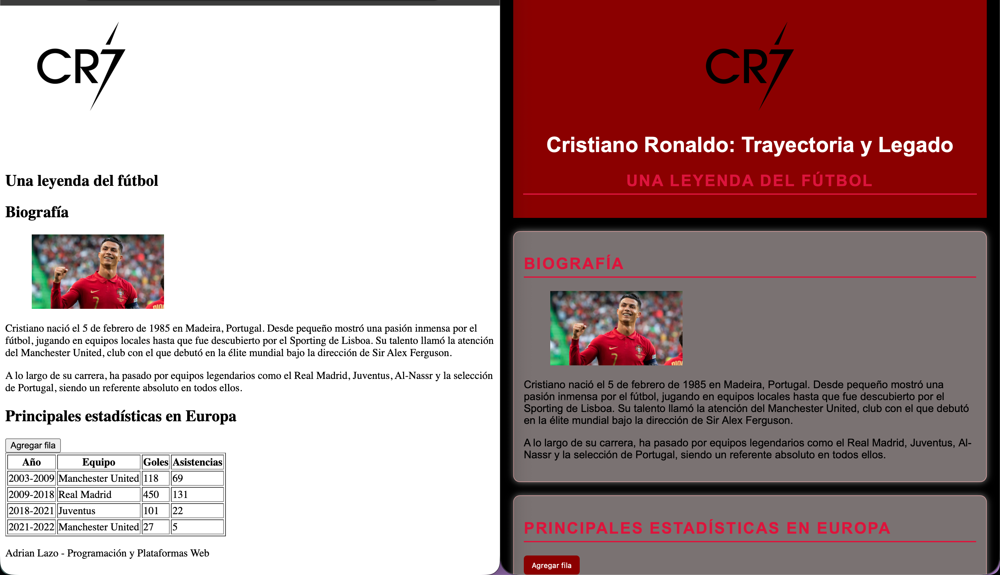

# Programación y Plataformas Web (PPW)

---

#  Práctica 1 – Explorando los Estándares Web con HTML, CSS y JavaScript

**Asignatura:** Programación y Plataformas Web  
**Unidad:** 1.2 – Estándares Web  
**Estudiante:** Adrian Lazo  
**Repositorio:** [https://github.com/scomygod/icc-ppw-u1-miPrimeraPagina.git](https://github.com/scomygod/icc-ppw-u1-miPrimeraPagina.git)  
**Página desplegada (GitHub Pages):** [https://scomygod.github.io/icc-ppw-u1-miPrimeraPagina/](https://scomygod.github.io/icc-ppw-u1-miPrimeraPagina/)  

---

## Estructura HTML utilizada

| Componente | Descripción | Implementación |
|-------------|--------------|----------------|
| `<!DOCTYPE html>` | Declaración del documento HTML5 | Línea 1 |
| `<html lang="es">` | Idioma del documento | Español |
| `<header>` | Encabezado principal | Contiene `<h1>` y `<h2>` y logo |
| `<section>` | Agrupa contenido principal | Dos secciones con `<h2>` y `<article>` |
| `<table>` | Muestra los elementos estudiados | Filas con `<th>` y `<td>` |
| `<footer>` | Pie de página | Nombre del estudiante y asignatura |

---

## Nuevas etiquetas exploradas

| Etiqueta | Descripción | Implementación |
|-----------|--------------|----------------|
| `<figure>` | Contenedor para imagen con pie de foto | Logo de Cristiano Ronaldo |
| `<article>` | Sección independiente de contenido | Biografía de Cristiano Ronaldo |

---

#  Práctica 2 – Adición de CSS y JavaScript
---

### 1. Archivos agregados

| Archivo     | Descripción                                                                                         | Ubicación                 |
| ----------- | --------------------------------------------------------------------------------------------------- | ------------------------- |
| `style.css` | Contiene todos los estilos visuales del sitio (colores, tipografía, márgenes, botones, tabla, etc.) | Carpeta raíz del proyecto |
| `script.js` | Contiene las funciones y eventos JavaScript que agregan comportamiento dinámico                     | Carpeta raíz del proyecto |

Estructura final del proyecto:
```
icc-ppw-u1-mi_pagina_web/
│
├── index.html
├── style.css
├── script.js
└── README.md
```

---

### 2. Implementación en HTML

**En el `<head>` (para el CSS):**

```html
<link rel="stylesheet" href="style.css">
```
**Antes de cerrar el `<body>` (para el JavaScript):**
``` html
<script src="script.js"></script>
```

---

### 3. Estilos aplicados con CSS
| Elemento | Estilo implementado | Descripción |
|----------|-------------------|------------|
| body | background-color: black; font-family: Arial, sans-serif; margin: 20px; | Color de fondo, tipografía y márgenes generales |
| header | background-color: darkred; color: white; text-align: center; padding: 15px; | Encabezado con color y centrado de texto |
| table | border-collapse: collapse; width: 100%; | Tabla visualmente uniforme |
| button | background-color: darkred; color: white; border: none; padding: 8px 12px; border-radius: 5px; cursor: pointer; | Botón estilizado con hover |
| section | margin: 20px 0; padding: 15px; background-color: #7a7272; border: 1px solid rgb(208, 156, 156); border-radius: 10px; box-shadow: 0 0 10px gray; | Secciones con fondo y bordes |

### Propiedades CSS nuevas exploradas

# Propiedades nuevas CSS

| Propiedad nueva    | Descripción |
|-------------------|-------------|
| text-transform     | Aplicada en los títulos `<h2>` para convertir el texto a mayúsculas automáticamente. |
| letter-spacing     | Aplicada en los títulos `<h2>` para aumentar el espacio entre las letras y mejorar la legibilidad. |

---

## Footer

Se agregó un `footer` al final de la página porque inicialmente no se visualizaba. Esto pasaba porque el fondo del `body` era negro y el texto también. Para solucionarlo, se aplicaron estilos de color de fondo oscuro, texto blanco, padding y borde superior.

**Ejemplo en el código:**
```css
button {
  background-color: darkred;
  color: white;
  border: none;
  border-radius: 5px;
  padding: 8px 12px;
  cursor: pointer;
}

button:hover {
  background-color: crimson;
}
```

###  4. Interactividad agregada con JavaScript

El archivo `script.js` incorpora dos acciones básicas:

1. **Agregar una nueva fila a la tabla al presionar el botón**

   ```javascript
   document.getElementById("agregarFila").addEventListener("click", () => {
     const tabla = document.querySelector("table");
     const nuevaFila = tabla.insertRow();
     nuevaFila.innerHTML = "<td>&lt;article&gt;</td><td>Sección independiente del contenido</td>";
   });
   ```

2. **Cambiar el color del título al pasar el mouse por encima**

   ```javascript
   const titulo = document.getElementById("titulo");
   titulo.addEventListener("mouseover", () => {
     titulo.style.color = "orange";
   });
   titulo.addEventListener("mouseout", () => {
     titulo.style.color = "white";
   });
   ```

3.	**Mostrar alerta al hacer doble clic en el título**

    ```javascript
    titulo.addEventListener("dblclick", () => {
    alert("¡Sí, este es el título");
    });
    ```

## Capturas de pantalla del proyecto final
### Versión sin CSS/JS del lado izquierdo y con CSS/JS del lado derecho

